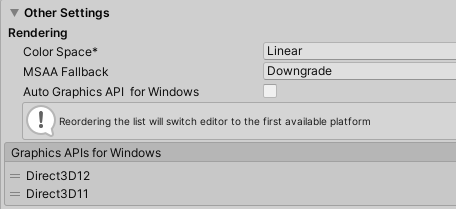
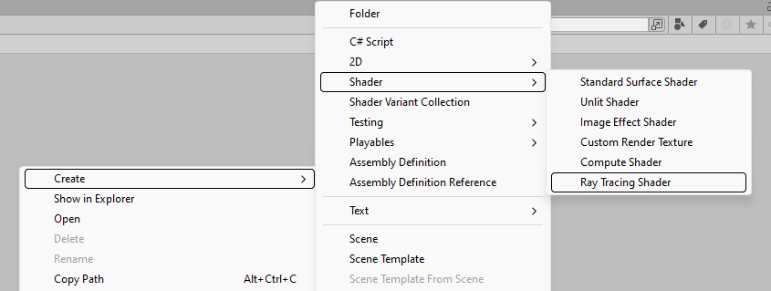

<div align="center">

# Ray Tracing SRP

Unity RTX On!

</div>

## Table of Content:

- [GPU Ray Tracing](#)
  - [Overview](#overview)
     - [Setting Up the Environment](#setting-up-the-environment)
     - [Import the Dependencies](#import-the-dependencies)
  - [1. Outputting an Image](#1-outputting-an-image)
    - [1.1. Create a RayTraceShader in Unity](#11-create-a-raytraceshader-in-unity)
    - [1.2. Rendering in C# using the SRP Pipeline](#12-rendering-in-c-using-the-srp-pipeline)
    - [1.3. Final Output](#13-final-output)
  - [2. Outputting the Background](#2-outputting-the-background)
    - [2.1. Create a RayTraceShader in Unity](#21-creating-a-raytraceshader-in-unity)
    - [2.2. Rendering in C# using the SRP Pipeline](#22-rendering-in-c-using-the-srp-pipeline)
    - [2.3. Final Output](#23-final-output)
  - [3. Rendering a Sphere](#3-rendering-a-sphere)
    - [3.1. Create a RayTraceShader in Unity](#31-creating-a-raytraceshader-in-unity)
    - [3.2. Creating the Sphere Shader](#32-creating-the-sphere-shader)
    - [3.3. Rendering in C# using the SRP Pipeline](#33-rendering-in-c-using-the-srp-pipeline)
    - [3.4. Final Output](#34-final-output)

## Overview

This tutorial is based on [Ray Tracing in One Weekend](https://raytracing.github.io/books/RayTracingInOneWeekend.html)
and explains how to implement Ray Tracing using Unity's SRP and DXR. Therefore,
before reading this article, it’s recommended to first go through the tutorial.
The algorithms are explained there, so this guide will focus on implementing Ray
Tracing in Unity.

### Setting Up the Environment

This implementation is based on Unity 2020+ with integrated DXR, requiring basic
configuration for the Unity project.



The first step is to set the Graphics API to Direct3D12.

### Import the Dependencies

Since we are using the SRP (Scriptable Render Pipeline) library, the following
Unity packages must be imported:


## 1. Outputting an Image

**Tutorial class**: `OutputColorTutorial`

**Scene file**: `OutputColorTutorialScene`

Generating the coord image using Ray Tracing Shader is a great starting point
for exploring its capabilities.

### 1.1. Create a RayTraceShader in Unity

To create a Ray Trace Shader in Unity, follow these steps: In the `Project`
panel, right click and select `Create → Shader → Ray Tracing Shader`.



Replace the content of the shader with the following code:

```glsl
#pragma max_recursion_depth 1

RWTexture2D<float4> _OutputTarget;

[shader("raygeneration")]
void OutputColorRayGenShader()
{
  uint2 dispatchIdx = DispatchRaysIndex().xy;
  uint2 dispatchDim = DispatchRaysDimensions().xy;

  _OutputTarget[dispatchIdx] = float4((float)dispatchIdx.x / dispatchDim.x, (float)dispatchIdx.y / dispatchDim.y, 0.2f, 1.0f);
}
```

* **DispatchRaysIndex().xy** returns the current pixel position.

* **DispatchRaysDimensions().xy** returns the dimensions of the render target.

This code adjusts the R and G channels of each pixel: the R channel ranges from
0 to 1 from left to right, the G channel from 0 to 1 from bottom to top, while
the B channel remains constant at 0.2 for all pixels.

### 1.2. Rendering in C# using the SRP Pipeline

The following C# code integrates the shader into Unity's render pipeline:

```csharp
var outputTarget = RequireOutputTarget(camera);

var cmd = CommandBufferPool.Get(nameof(OutputColorTutorial));
try
{
  using (new ProfilingSample(cmd, "RayTracing"))
  {
    cmd.SetRayTracingTextureParam(m_Shader, s_OutputTarget, outputTarget);
    cmd.DispatchRays(m_Shader, "OutputColorRayGenShader", (uint) outputTarget.rt.width, (uint) outputTarget.rt.height, 1, camera);
  }
  context.ExecuteCommandBuffer(cmd);

  using (new ProfilingSample(cmd, "FinalBlit"))
  {
    cmd.Blit(outputTarget, BuiltinRenderTextureType.CameraTarget, Vector2.one, Vector2.zero);
  }
  context.ExecuteCommandBuffer(cmd);
}
finally
{
  CommandBufferPool.Release(cmd);
}
```

* **RequireOutputTarget** retrieves the render target based on the camera's
  output.

* **cmd.SetRayTracingTextureParam** sets the render target for the Ray Trace
  Shader. Here, *m_Shader* refers to the Ray Tracing Shader Program, and
  *s_OutputTarget* is obtained via `Shader.PropertyToID("_OutputTarget")`.

* **cmd.DispatchRays** invokes the ray generation function `OutputColorRayGenShader`
  in the RayTrace Shader for Ray Tracing.

Since the Ray Trace Shader only renders to a render target, a Blit operation is
required to display the result on the screen.

### 1.3. Final Output

After setting everything up, running the code should produce the following image:


## 2. Outputting the Background

**Tutorial class**: BackgroundTutorial

**Scene file**: BackgroundTutorialScene

In this section, we will render a gradient background using Ray Tracing.

### 2.1. Creating a RayTraceShader in Unity

Create the following Ray Tracing Shader to generate the background:

```glsl
inline void GenerateCameraRay(out float3 origin, out float3 direction)
{
  // center in the middle of the pixel.
  float2 xy = DispatchRaysIndex().xy + 0.5f;
  float2 screenPos = xy / DispatchRaysDimensions().xy * 2.0f - 1.0f;

  // Un project the pixel coordinate into a ray.
  float4 world = mul(_InvCameraViewProj, float4(screenPos, 0, 1));

  world.xyz /= world.w;
  origin = _WorldSpaceCameraPos.xyz;
  direction = normalize(world.xyz - origin);
}

inline float3 Color(float3 origin, float3 direction)
{
  float t = 0.5f * (direction.y + 1.0f);
  return (1.0f - t) * float3(1.0f, 1.0f, 1.0f) + t * float3(0.5f, 0.7f, 1.0f);
}

[shader("raygeneration")]
void BackgroundRayGenShader()
{
  const uint2 dispatchIdx = DispatchRaysIndex().xy;

  float3 origin;
  float3 direction;
  GenerateCameraRay(origin, direction);

  _OutputTarget[dispatchIdx] = float4(Color(origin, direction), 1.0f);
}
```

* **GenerateCameraRay** calculates the origin and direction of the ray for the
  current pixel.

* The **Color** function calculates a gradient from top to bottom, creating the
  background effect.

### 2.2. Rendering in C# using the SRP Pipeline

To set up the camera parameters in C#, use the following code:

```csharp
Shader.SetGlobalVector(CameraShaderParams._WorldSpaceCameraPos, camera.transform.position);
var projMatrix = GL.GetGPUProjectionMatrix(camera.projectionMatrix, false);
var viewMatrix = camera.worldToCameraMatrix;
var viewProjMatrix = projMatrix * viewMatrix;
var invViewProjMatrix = Matrix4x4.Inverse(viewProjMatrix);
Shader.SetGlobalMatrix(CameraShaderParams._InvCameraViewProj, invViewProjMatrix);
```

The SRP pipeline integration is as follows:

```csharp
var outputTarget = RequireOutputTarget(camera);

var cmd = CommandBufferPool.Get(nameof(BackgroundTutorial));
try
{
  using (new ProfilingSample(cmd, "RayTracing"))
  {
    cmd.SetRayTracingTextureParam(m_Shader, s_OutputTarget, outputTarget);
    cmd.DispatchRays(m_Shader, "BackgroundRayGenShader", (uint) outputTarget.rt.width, (uint) outputTarget.rt.height, 1, camera);
  }
  context.ExecuteCommandBuffer(cmd);

  using (new ProfilingSample(cmd, "FinalBlit"))
  {
    cmd.Blit(outputTarget, BuiltinRenderTextureType.CameraTarget, Vector2.one, Vector2.zero);
  }
  context.ExecuteCommandBuffer(cmd);
}
finally
{
  CommandBufferPool.Release(cmd);
}
```

The difference here is the invocation of a different Ray Trace Shader.

### 2.3. Final Output

Here is the resulting image:


## 3. Rendering a Sphere

**Tutorial Class**: AddASphereTutorial

**Scene File**: AddASphereTutorialScene

This section demonstrates how to render a sphere using ray tracing. Note that
since Unity's current DXR integration does not support the Intersection Shader,
we cannot use procedural geometry as in the original text. Instead, we will use
a sphere mesh for rendering.

### 3.1. Creating a RayTraceShader in Unity

```glsl
struct RayIntersection
{
  float4 color;
};

inline float3 BackgroundColor(float3 origin, float3 direction)
{
  float t = 0.5f * (direction.y + 1.0f);
  return (1.0f - t) * float3(1.0f, 1.0f, 1.0f) + t * float3(0.5f, 0.7f, 1.0f);
}

[shader("raygeneration")]
void AddASphereRayGenShader()
{
  const uint2 dispatchIdx = DispatchRaysIndex().xy;

  float3 origin;
  float3 direction;
  GenerateCameraRay(origin, direction);

  RayDesc rayDescriptor;
  rayDescriptor.Origin = origin;
  rayDescriptor.Direction = direction;
  rayDescriptor.TMin = 1e-5f;
  rayDescriptor.TMax = _CameraFarDistance;

  RayIntersection rayIntersection;
  rayIntersection.color = float4(0.0f, 0.0f, 0.0f, 0.0f);

  TraceRay(_AccelerationStructure, RAY_FLAG_CULL_BACK_FACING_TRIANGLES, 0xFF, 0, 1, 0, rayDescriptor, rayIntersection);

  _OutputTarget[dispatchIdx] = rayIntersection.color;
}

[shader("miss")]
void MissShader(inout RayIntersection rayIntersection : SV_RayPayload)
{
  float3 origin = WorldRayOrigin();
  float3 direction = WorldRayDirection();
  rayIntersection.color = float4(BackgroundColor(origin, direction), 1.0f);
}
```

In the **ray generation shader**, the `TraceRay` function is used to cast rays.
For detailed usage, please refer to the
[Microsoft DXR documentation](https://microsoft.github.io/DirectX-Specs/d3d/Raytracing.html#hit-groups).

* **RayDesc** describes the ray, with *Origin* as the starting point of the ray,
  *Direction* as the ray’s direction, *TMin* as the minimum value of t, and
  *TMax* as the maximum value of t (in the code, it is set to the camera's far
  clipping distance).
* **RayIntersection** is a user-defined Ray Payload structure that is used to
  pass data during ray tracing. In this case, the *color* field is used to store
  the result of the ray trace.

Additionally, we have included a **miss shader**, which is executed when no ray
intersections are detected. In this shader, we call the *BackgroundColor*
function to return the gradient background color defined in section 3.

### 3.2. Creating the Sphere Shader

Create a surface shader file in Unity and add the following code at the end.

```glsl
SubShader
{
  Pass
  {
    Name "RayTracing"
    Tags { "LightMode" = "RayTracing" }

    HLSLPROGRAM

    #pragma raytracing test

    struct RayIntersection
    {
      float4 color;
    };

    CBUFFER_START(UnityPerMaterial)
    float4 _Color;
    CBUFFER_END

    [shader("closesthit")]
    void ClosestHitShader(inout RayIntersection rayIntersection : SV_RayPayload, AttributeData attributeData : SV_IntersectionAttributes)
    {
      rayIntersection.color = _Color;
    }

    ENDHLSL
  }
}
```

In this shader, we define a **SubShader** with a pass named "RayTracing." This
name can be customized as needed. In the subsequent C# code, you will see how
this pass is specifically referenced.

The directive **#pragma raytracing test** indicates that this is a Ray Tracing
pass.

The **ClosestHitShader** accepts two parameters:

1. **rayIntersection**, which carries the Ray Payload data passed from the ray
   generation shader.
2. **attributeData**, which contains intersection data, although it is not used
   in this example. The shader simply returns a predefined color.

### 3.3. Rendering in C# using the SRP Pipeline

Setting the camera parameters in C# follows the same approach as in section 3.

The following C# code is used in the SRP pipeline:

```csharp
var outputTarget = RequireOutputTarget(camera);

var accelerationStructure = m_Pipeline.AccelerationStructure;

var cmd = CommandBufferPool.Get(nameof(AddASphereTutorial));
try
{
  using (new ProfilingSample(cmd, "RayTracing"))
  {
    cmd.SetRayTracingShaderPass(m_Shader, "RayTracing");
    cmd.SetRayTracingAccelerationStructure(m_Shader, RayTracingRenderPipeline.s_AccelerationStructure, accelerationStructure);
    cmd.SetRayTracingTextureParam(m_Shader, s_OutputTarget, outputTarget);
    cmd.DispatchRays(m_Shader, "AddASphereRayGenShader", (uint) outputTarget.rt.width, (uint) outputTarget.rt.height, 1, camera);
  }
  context.ExecuteCommandBuffer(cmd);

  using (new ProfilingSample(cmd, "FinalBlit"))
  {
    cmd.Blit(outputTarget, BuiltinRenderTextureType.CameraTarget, Vector2.one, Vector2.zero);
  }
  context.ExecuteCommandBuffer(cmd);
}
finally
{
  CommandBufferPool.Release(cmd);
}
```

### 3.4 Final Output


